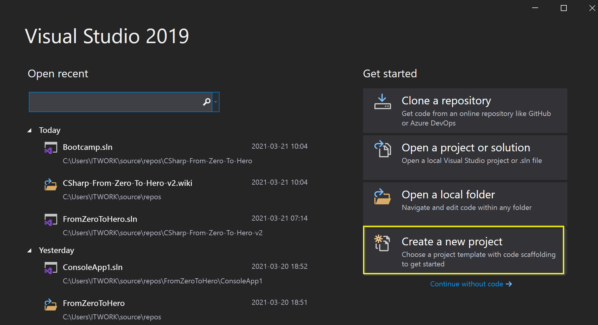
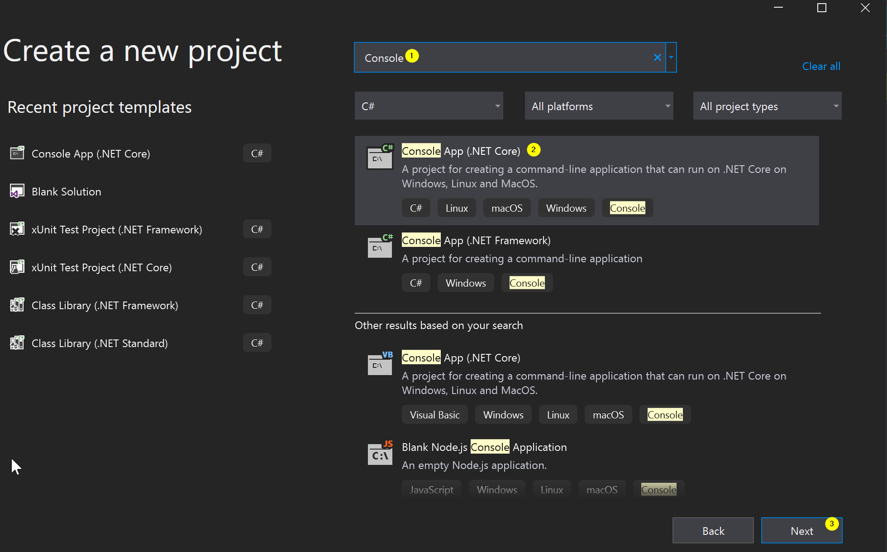
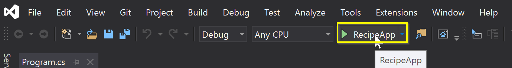
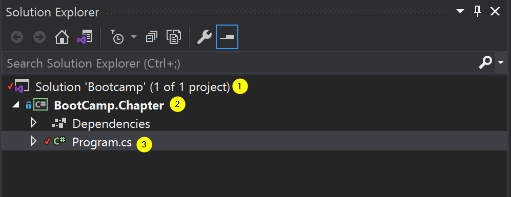
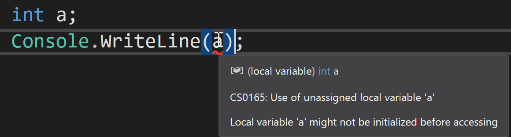

Programming is an act of solving problems through writing code. And code is just a set of instructions for a computer to execute.

I would like to invite you to a programming journey and take your first steps using C#.

## What is C#?

C# is a multi-purpose high level programming language. That means that you don't need to manage much of low level things (like memory assignment or machine instructions). Those things are abstracted away from you through a managed environment.

With C#, you can create:
- Webservices (ASP.NET Core)
- Desktop apps (Winforms, UWP, WPF)
- Mobile apps (Xamarin)
- Games (Unity)
- And more!

You can create pretty much anything you want using C#!

Most commonly, it is used for building enterprise business applications. It's a language heavilly supported by Microsoft, loved by the community and has a good future ahead of it. The latest available version (as of time of writing) is C# 9.

## .NET

.NET is an ecosystem which adds all sorts of features built on top of C#. For example: reading a file, getting data from a URL, sending an email, connecting to a database, etc. .NET also includes other languages: Visual Basic and F#, however we will not be covering those during the boot camp.

## Visual Studio

A writer needs a pen and paper; a programmer needs an IDE (integrated development environment). IDE provides a programmer with all the needed tools to do their job: code editor, debugger, code runner, compiler, etc.

Visual Studio is an IDE for .NET.

In order to set Visual Studio up, refer to [this video](https://youtu.be/Zm0bNCrfUvw).

### Your First Program

#### New Project

In order to start making something yourself, you will need to open Visual Studio and select `Create a new project`:



The most simple application you can create is a console application. In the next window, type `console` and select `Console App (.NE Core)`. Make sure you select the one with C# tag on it:



In the next window, name your program `RecipeApp` (or anything you want) and hit `Create`.


#### Run, programmer, run!

A new window opens with your very first project! Well, what are you waiting for? Run it! You can do this by either hitting `F5` or by clicking a `run button` at the top of the window:



On behalf of all the programmers of the world, welcome! `Hello World!` is how even the greatest programming heroes of today have started their journey. What you can see is a `console application` - a window without any user interface- just plain text on a black background. You can close the console window now to focus back on Visual Studio.

#### What did just happen?

We just ran our first code- `Program.cs`. We `compiled` the code file- converted code into machine instructions- and our computer has executed them. To be precise, this code has been executed:

```cs
using System;

namespace RecipeApp
{
    class Program
    {
        static void Main(string[] args)
        {
            Console.WriteLine("Hello World!");
        }
    }
}
```

Let's try to understand it!

The file starts with a `using System;` statement. `using` is needed, when we want to refer code which is in a different namespace. A `namespace` is just a container for multiple code files- usually a namespace is named after a physical directory path which holds the code. `System` namespace contains code for basic interactions with a system, including - `Console` - therefore we had to import it. The word `statement`- means a single instruction of code to execute and in C# a statement needs to end with `;`.

Next is a `namespace RecipeApp`. Code must belong in some namespace and the first one in our code is usually named after a project it belongs to.

Next- a `{`. This refers to a `scope`- an access boundary of code. Scope has a start `{` and an end `}`. This scope is scope of a namespace. Code outside of a scope (`namespace RecipeApp` in our case) is not accessible by default (unless we import it with a using statement). If there was no such thing as a scope, it would be really hard to pick what we want, because everything would be acessible to us.

After that follows a `class`. It's like a container for many code blocks. `Program` is a class which contains logic to start our application. The name itself can be anything, but the name we have is the default for a startup class. A class has its own scope too `{}`.

`static void Main(string[] args)` is an `entry point` of our application. It is a `function`- a container for a single logical block of code. Every function should tell 1 thing for a computer to do. In our case- it runs the application which prints `Hello World`. A function has its own scope as well `{}`.

`Console.WriteLine("Hello World!");` - is the code which makes a call to print text on the console screen. Most of the code will be written inside functions. 

Where (scope) you write code matters. For now, all the code we write will be inside the `Main` function.

#### Solution Structure

The new project contains a bit more than just the `Program.cs` file.
Focus your attention on the right side of 



On the right side (by default) you can see a `Solution Explorer`. In .NET, a solution (marked as 1) is a container for all files needed that your program is made of. Essentially, treat a `solution` as a container of projects (marked as 2).  Project is like a module (or a layer) for a full program, which provides functionality for some (or all) of it. Projects are made of different files, but for now, we will focus .cs file. For code to be compiled as C# code, it needs to be put in .cs files (marked as 3).

___

## Variables

Variables are essentially data. For a variable to be meaningful, it needs to have 3 things:

* Type- what kind of data can a variable hold? There are 3 primitive variable categories: numbers, text and logical.
* Name- how will we refer to a variable? Can only be made of [aA-zZ], _, @, [0-9]. 
* Value- what data does the variable hold?   

You can declare a variable without a value, but C# compiler won't let you use it, because it has no value (is not initialized). Example of such error can be seen in the image below.



### Numbers

Number types are divided into two groups. Whole numbers and numbers with a fraction.

#### Whole numbers

| Type     |   Bits  |  Min value             |      Max value     :|
|----------|:-------:|-----------------------:|--------------------:|
| byte     |    8    |         0              |      255:           |
| short    |    16   |      -32 768           |    32,767           |
| int      |    32   |    -2 147 483 648      |  2 147 483 648      |
| long     |    64   |    -9x10<sup>18</sup>  |  9x10<sup>18</sup>  |


Default is int.  

Note: Most whole number types have unsigned versions of them, which double their size. For example, short is 32 767 max value, but ushort is 65 535, however, min value of ushort is 0 (no negative).

#### Floating point numbers (numbers with fraction)

| Type     |   Bits  |  Value                                              |   symbol  :|
|----------|:-------:|----------------------------------------------------:|-----------:|
| float    |    32   |  ±1.5 x 10<sup>−45</sup> to ±3.4 x 10<sup>38<sup>   |     f      |
| double   |    64   |  ±1.5 x 10<sup>−45</sup> to ±3.4 x 10<sup>38</sup>  |     d      |
| deciaml  |    128  |  ±1.5 x 10<sup>−45</sup> to ±3.4 x 10<sup>38</sup>  |     m      |

Default is double.  

Note: if you want to declare a variable as float or decimal, you will need to explicitly say so by either:  
A: using type symbol `float f = 2.0f;`  
B: casting `float f = (float) 2.0;`  
*Important*: for money or scientific calculations use decimal.  

### Text

char- is a single symbol.
To store a char use single quotes ('').

`char myChar = 'a';`

string- is many symbols. To store a string use double quotes ("").

`string myStr = "Joe#2020";`

Note: you cannot store an empty character (''- won't compile), but you can store an empty string.

### Logical

bool is a logical type. It can be either true or false. Logical variables drive logical statements, but about that in later lessons.

## Arithmetics

### Addition results

| Type1    |   Type2 |  Result type   |
|:--------:|:-------:|:--------------:|
| byte     |   int   |      int       |
| char     |   char  |      int       |
| char     |   int   |      int       |
| string   |  string |    string      | 
| string   |   char  |    string      |
| string   |   long  |    string      |

Note: subtraction is identical, except that we cannot one string from another.  
Note: adding two values of different types will store the result in type with bigger space. This is done to avoid buffer overflow.

### Division & Multiplication

Both are trivial and applicable only to number types.  
Dividing number you should pay attention because you if divide from the higher number, the result will be 0.  
For example: `1/2=0`.  
If we want the result to be 0.5, all we need to do is to add a fraction to either of the numbers when dividing.  
Like so: `1/2.0=0.5`.
  
Like in normal maths, division from 0 is impossible. Also, division and multiplication has priority over addition and subtraction.

## Console

Console is the minimum kind of display for printing data. All the functions that console are exposed under ``System.Console`` class.

### Write

To write text to console, all you have to do is `Console.Write("My text");`. 
To write a line of text to console, all you have to do is `Console.WriteLine("My text");`. 
The printed text will appear without "" because the quotation marks are used to have a distinction between code and text, but such distinction is no longer needed when printing text.  
Note: if you type `cw` in code editor and press tab, it will autocomplete the snippet with `Console.WriteLine();`

### Read

We can read user input in many different ways, but for now, we will focus on the most simple one- `Console.ReadLine();`. This will try to read a line of text that a user typed and pressed enter. For example `string name = Console.ReadLine();`.

### var keyword

You don't have to always explicitly declare a variable with a type. It might get tedious sometimes, especially when types get more complex and long. Sometimes we either don't care about a type or it's extremely obvious what the type is. By convention, in most cases, we use `var` to define a type. For example: ``var name = "Kaisinel;". Type of name, in this case, will be string. Compiler is smart enough to know the type in most cases and when it doesn't, you will have to hint it with explicit types, casting or other...

Note: `var` doesn't make C# to determine type on the fly. If you hover over `var` in IDE, you will still see the actual type.

___

## Homework

Read name, surname, age, weight (in kg) and height (in cm) from console.
1) Print all the info based on the example message below:
```
Tom Jefferson is 19 years old, his weight is 50 kg and his height is 156.5 cm. 
```
2) Calculate and print body-mass index (BMI)
3) Do 1 and 2 for another person.